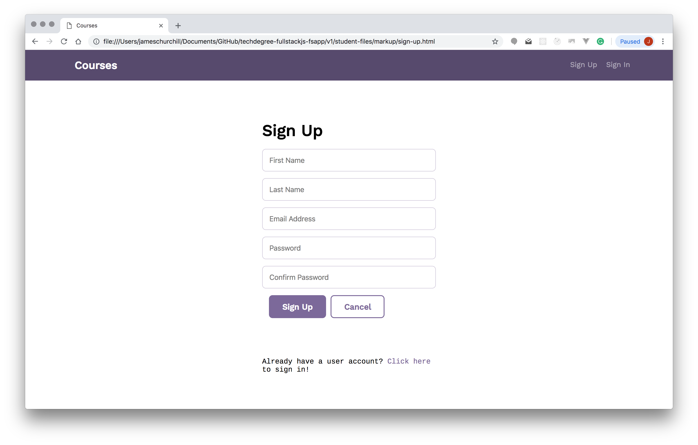
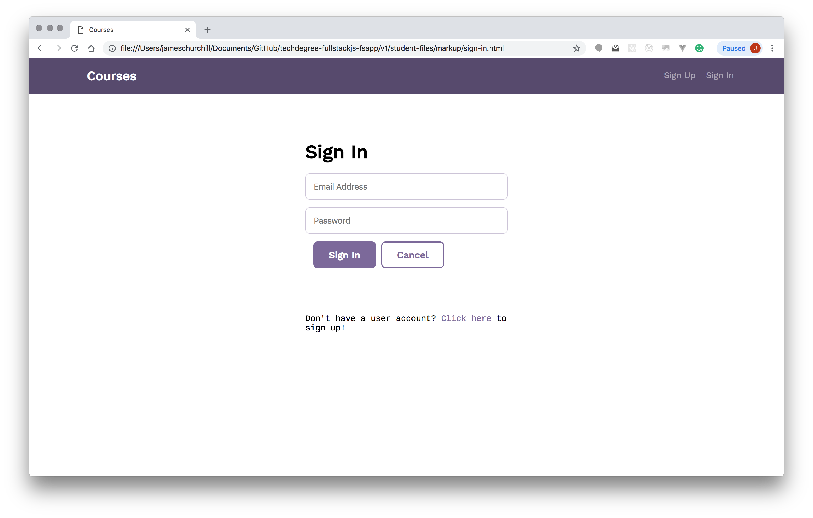
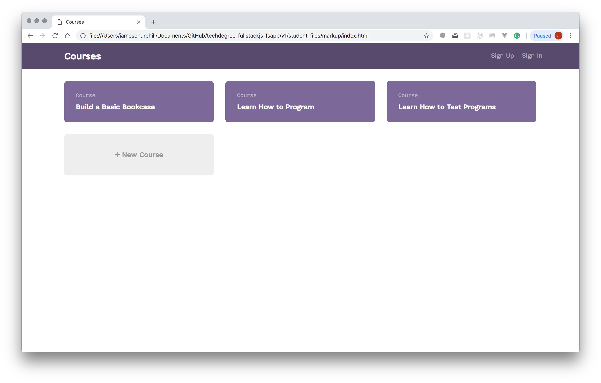
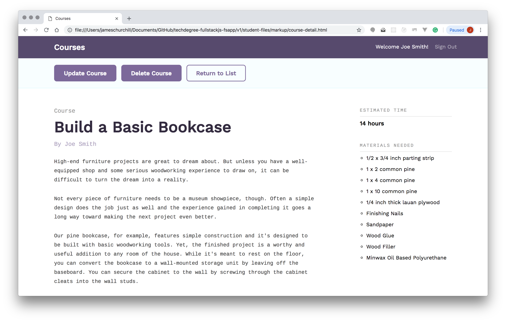
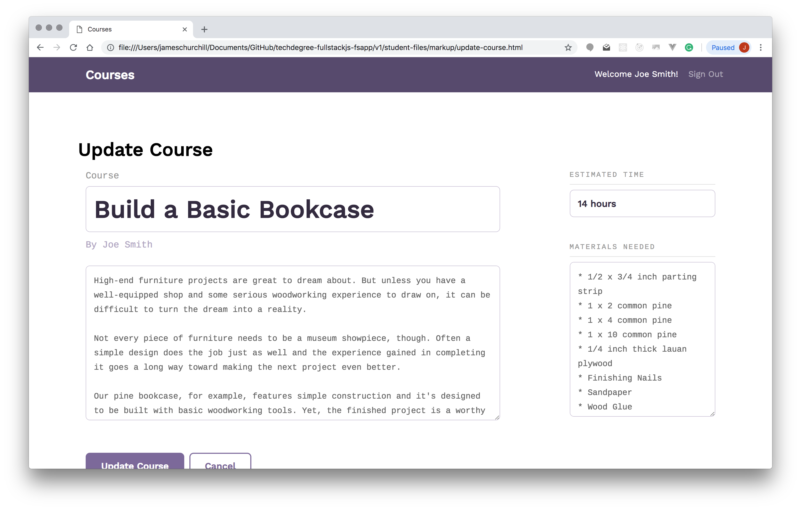
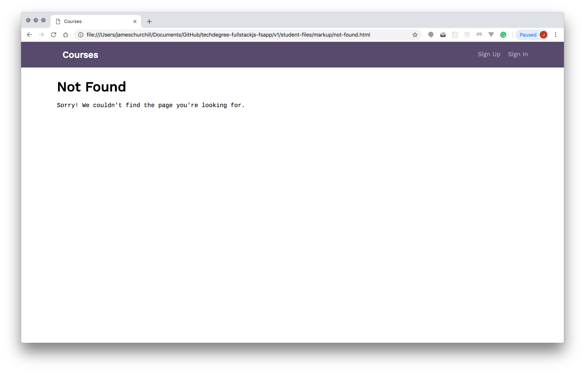
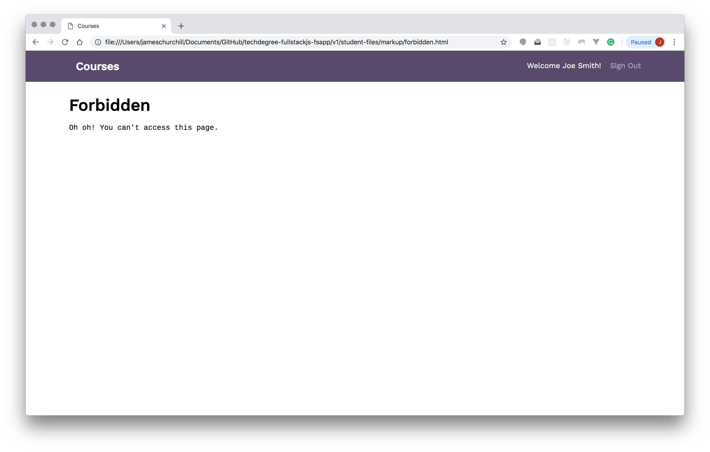
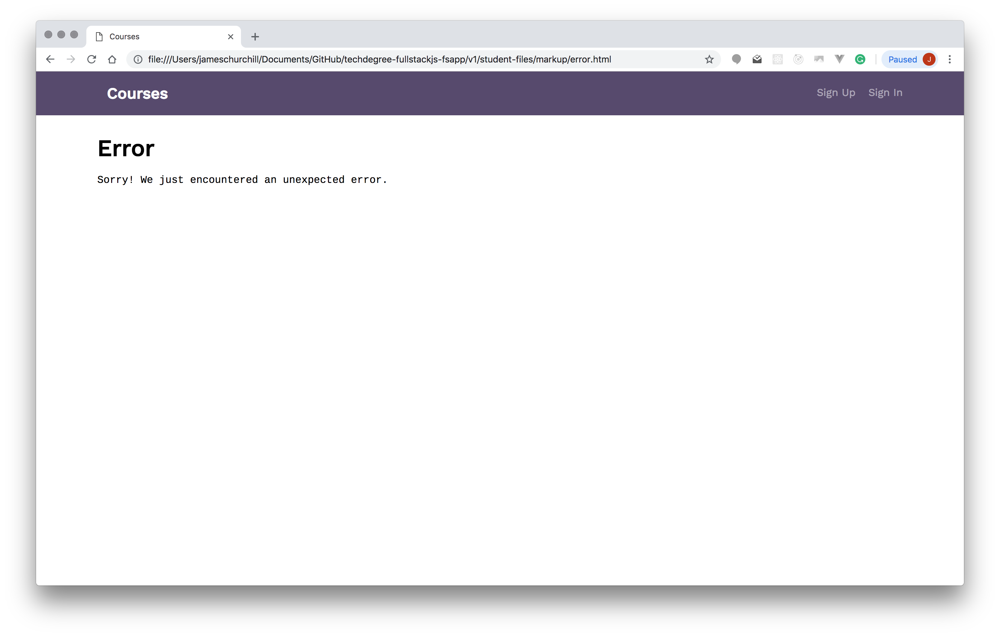

# Full Stack App with React and a REST API :fire: :fire: :fire:
This is the 10th and final project as part of Treehouse's Fullstack JavaScript Techdegree!
It is the full stack application that will provide a way for users to administer a school database containing information about courses: users can interact with the database by retrieving a list of courses, viewing detail for a specific course, as well as creating, updating and deleting courses in the database.

In addition, the project will require users to create an account and sign in to make changes to the database. 

## Technologies Used
* React (Create-react-app)
* Functional and Class based components
* React Router to setup routes
* Redux for global state management
* Axios for API calls
* Node.js , Express and MongoDB for API layer

## How to run the project locally
### Setup API project
* Go to the `/api` directory
* Run `npm install`
* Run `npm start`
* Voila! API server is running on port 5000 and Your MongoDB is also setup and running in the background! :clap:

### Setup React App
* Go to `/client` folder
* Run `npm install`
* Run `npm start`
* React app should start in your browser at `http://localhost:3000`. Have fun! :thumbsup:

### About the React App
#### Components
* Stateful class components:

    * Courses - This component provides the "Courses" screen by retrieving the list of courses from the REST API's /api/courses route and rendering a list of courses. Each course needs to link to its respective "Course Detail" screen. This component also renders a link to the "Create Course" screen.

    * CourseDetail - This component provides the "Course Detail" screen by retrieving the detail for a course from the REST API's /api/courses/:id route and rendering the course. The component also renders a "Delete Course" button that when clicked should send a DELETE request to the REST API's /api/courses/:id route in order to delete a course. This component also renders an "Update Course" button for navigating to the "Update Course" screen.
    
    * UserSignIn - This component provides the "Sign In" screen by rendering a form that allows a user to sign using their existing account information. The component also renders a "Sign In" button that when clicked signs in the user and a "Cancel" button that returns the user to the default route (i.e. the list of courses).
    
    * UserSignUp - This component provides the "Sign Up" screen by rendering a form that allows a user to sign up by creating a new account. The component also renders a "Sign Up" button that when clicked sends a POST request to the REST API's /api/users route and signs in the user. This component also renders a "Cancel" button that returns the user to the default route (i.e. the list of courses).
    
    * CreateCourse - This component provides the "Create Course" screen by rendering a form that allows a user to create a new course. The component also renders a "Create Course" button that when clicked sends a POST request to the REST API's /api/courses route. This component also renders a "Cancel" button that returns the user to the default route (i.e. the list of courses).
    
    * UpdateCourse - This component provides the "Update Course" screen by rendering a form that allows a user to update one of their existing courses. The component also renders an "Update Course" button that when clicked sends a PUT request to the REST API's /api/courses/:id route. This component also renders a "Cancel" button that returns the user to the "Course Detail" screen.
    
* Stateless functional components:
    * Header- Displays the top menu bar for the application and includes buttons for signing in and signing up (if there's not an authenticated user) or the user's first and last name and a button for signing out (if there's an authenticated user).
    
    * UserSignOut - This component is a bit of an oddball as it doesn't render any visual elements. Instead, it signs out the authenticated user and redirects the user to the default route (i.e. the list of courses).
#### Routes
* Public Routes
    * / - Courses
    * /courses/:id - CourseDetail
    * /signin - UserSignIn
    * /signup - UserSignUp
    * /signout - UserSignOut
* Protected Routes
    * /courses/create - CreateCourse
    * /courses/:id/update - UpdateCourse

## Screenshots
### Sign up screen

### Sign in screen

### Home screen

### Course Detail screen

### Update Detail screen

### Error screens

